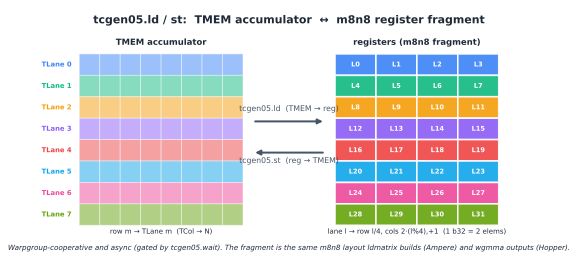

(chap_tmem)=
# 特殊内存：TMEM

<!--
翻译模板

英文源文件：chapter_tmem/index.md
建议：保留 TMEM/TLane/TCol、alloc/free、tcgen05.ld/st 等术语。
-->

:::{admonition} 概览
:class: overview

- TMEM 是 `tcgen05` 使用的 Blackwell 专属内存空间。它是每个 SM 上的二维暂存器，有 128 行 Lane 和最多 512 列 Col。
- `tcgen05.mma` 将其累加器写入 TMEM。块缩放 MMA 也使用 TMEM 存储缩放因子。
- TMEM 通过 Lane 和 Col 寻址。在 TIRx 布局符号中，这两个硬件轴写作 `TLane` 和 `TCol`。
- TMEM 不像寄存器那样被分配。内核必须显式地以 32 列为单位分配和释放它。
- 普通的共享内存加载和存储指令无法访问 TMEM。TMEM、寄存器和共享内存之间的数据移动通过专用的异步 `tcgen05` 指令进行。
:::

在 Hopper 及更早的 GPU 上，Tensor Core（{ref}`chap_tensor_cores`）累加器存在于寄存器中。这种模型易于理解。MMA 指令产生一个寄存器片段，内核在计算阶段保持该片段活跃，随后 epilogue 读取它、转换它，并存储结果。

问题是寄存器压力。寄存器是每个线程的固定资源。随着 MMA tile 增大，累加器片段也随之增大。在某个点上，累加器开始挤占线程需要持有的其他值。较大的 tile 有利于 Tensor Core 吞吐量，但将整个累加器保存在寄存器中使这些较大 tile 更难使用。

Blackwell 改变了数据路径的这一部分。`tcgen05` 的累加器不必在整个计算阶段都保存在寄存器中。相反，`tcgen05.mma` 将累加器写入张量内存，即 TMEM。TMEM 是早期 NVIDIA GPU 所没有的内存空间。它是 SM 上的二维暂存器，形状为 128 行 Lane 乘以最多 512 列 Col，作用域限定在使用它的 CTA。

这个额外的内存空间使 Blackwell 能够支持更大的 Tensor Core tile，而无需将整个累加器强制放入每线程寄存器中。但 TMEM 不像寄存器那样是自动的。编译器不会简单地将其作为普通寄存器存储来分配。内核必须分配 TMEM，以正确的布局寻址它，用正确的指令移入移出数据，并在 CTA 完成时释放它。

## 二维地址空间

TMEM 不是平坦的字节数组。它是一个二维地址空间。硬件将其两个坐标命名为 Lane 和 Col。有 128 行 Lane 和最多 512 列 Col。每列是一个 32 位列。

这种形状很重要，因为 `tcgen05.mma` 使用这种二维结构将其累加器写入 TMEM。TMEM 位置由 Lane 坐标和 Col 坐标描述，而不是由单个共享内存风格的字节偏移量描述。

当内核在 TIRx 中声明 TMEM 缓冲区时，它为缓冲区赋予一个跨越这两个硬件坐标的布局。在布局符号（{ref}`chap_data_layout`）中，我们将 TMEM Lane 轴写作 `TLane`，将 TMEM Col 轴写作 `TCol`。这些名称并非替代官方硬件术语。它们是在 DSL 内部明确 TMEM 维度的布局轴名称。

例如，累加器 tile 可以写作：

```text
S[(128, N) : (1@TLane, 1@TCol)]
```

这表示该 tile 沿硬件 Lane 维度有 128 行，沿硬件 Col 维度有 `N` 列。在布局符号中，这两个维度显示为 `TLane` 和 `TCol`。布局是直接的：相邻的行沿 `TLane` 移动，相邻的列沿 `TCol` 移动。下图展示了该网格，硬件 Lane 沿 128 行方向延伸，硬件 Col 沿列方向延伸。


主要要点是 TMEM 是 tile 布局故事的一部分。它不仅仅是 Tensor Core 的隐藏后备存储。内核必须命名该内存，从中分配列，并使用与 `tcgen05` 指令读写该内存相匹配的布局。

## 分配

在内核可以使用 TMEM 之前，它必须先在其中预留空间。这与寄存器不同。寄存器由编译器分配。TMEM 由内核显式分配。

分配按 CTA 进行。CTA 中的一个 warp 请求一段 TMEM 列。请求以 32 列为单位进行，请求的列数根据硬件分配规则向上取整。分配后，CTA 收到一个 TMEM 基地址。后续的 `tcgen05` 指令使用该基地址访问预留区域。

将 TMEM 视为一种有预算的 CTA 资源是很有用的，类似于共享内存。CTA 拥有它已分配的 TMEM 列。内核决定它需要多少列用于累加器、缩放因子或临时暂存。当 CTA 完成时，它必须释放该分配。

这使得 TMEM 成为内核资源规划的一部分。更大的累加器 tile 可能提高 Tensor Core 吞吐量，但会消耗更多 TMEM 列。块缩放 MMA 可能需要额外的 TMEM 空间用于缩放因子。内核必须在可用的 TMEM 预算内满足这些用途，就像它必须在 SMEM 预算内满足共享内存缓冲区一样。

## 读写 TMEM

普通的 `ld.shared` 和 `st.shared` 指令无法访问 TMEM。TMEM 是一个独立的地址空间，因此数据通过专用的 `tcgen05` 指令移动。

主要有三种路径。

第一种路径是 `tcgen05.ld`，它将数据从 TMEM 加载到寄存器。这是 MMA 阶段之后 epilogue 使用的路径。累加器已在 TMEM 中产生，但 epilogue 通常需要一个寄存器片段，以便进行类型转换、应用逐元素操作，并存储最终结果。

在 DSL 层面，TMEM 加载分布在一个 warpgroup 中。它下放到四个 warp 级的 `tcgen05.ld` 操作，每个 warp 一个。每个 warp 处理 128 行 TMEM Lane 中的 32 行，因此四个 warp 一起覆盖了整个 Lane 维度。在布局符号中，这个完整维度就是 `TLane` 轴。

该指令本身来自一系列加载形状，例如 `.16x64b`、`.16x128b`、`.16x256b`、`.32x32b` 和 `.16x32bx2`，重复因子从 `.x1` 到 `.x128`。选择的形状决定了读取多少 TMEM 列以及每个线程接收多少寄存器。

重要的结果是寄存器片段布局。对于常见的 epilogue 路径，lane `l` 从 TMEM 行 `l / 4` 和两列接收值。这产生了与早期世代直接从 MMA 暴露的相同类型的每 lane 累加器片段（{ref}`chap_layout_generations`）。这种连续性很重要。这意味着 Blackwell epilogue 可以重用已在 Ampere `mma` 或 Hopper `wgmma` 上使用的相同寄存器级类型转换和存储结构，尽管累加器在计算阶段存在于 TMEM 中。



第二种路径是 `tcgen05.st`，它将数据从寄存器存回 TMEM。这是 `tcgen05.ld` 的反向操作。当线程已经持有寄存器片段并需要将其放入 TMEM 时使用。例如，某些操作数或中间值可能通过寄存器暂存，然后写入 TMEM 供后续 `tcgen05` 操作使用。

第三种路径是 `tcgen05.cp`，它将数据从共享内存拷贝到 TMEM。这是一个批量拷贝路径，通常用于块缩放 MMA 中的缩放因子。在这种情况下，TMA 或普通线程代码首先在共享内存中准备好缩放数据，然后 `tcgen05.cp` 将其移动到 Tensor Core 期望的 TMEM 布局中。

所有三种路径都是异步的。`tcgen05.ld`、`tcgen05.st` 或 `tcgen05.cp` 指令可能在数据移动完成之前就返回。因此，内核必须在使用结果或重用存储之前使用正确的完成机制（{ref}`chap_async_barriers`）。

等待路径取决于指令。`tcgen05.ld` 通过 `tcgen05.wait::ld` 完成。`tcgen05.st` 通过 `tcgen05.wait::st` 完成。`tcgen05.cp`，如同 `tcgen05.mma`，通过提交组和 `mbarrier` 完成。如果数据从一组线程交到另一组线程，内核可能还需要 fence，以便接收线程按预期顺序看到已完成的写入。

TMEM 位于 Blackwell Tensor Core 数据路径的中间。TMA 将操作数暂存到共享内存。`tcgen05.mma` 读取其操作数并累加到 TMEM。对于块缩放 MMA，缩放因子也可以暂存到 TMEM。计算阶段之后，`tcgen05.ld` 将累加器带回寄存器，epilogue 转换并存储最终输出。
